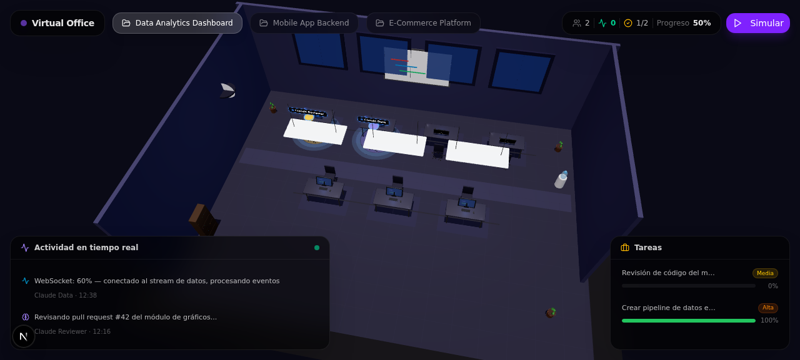

# Oficina Virtual

Visualización 3D en tiempo real de una oficina donde "trabajan" agentes de
IA: cada agente aparece en su escritorio, con una animación distinta según su
estado (escribiendo, pensando, en espera, en descanso), un tipo de "cerebro"
(Claude Opus/Sonnet/Haiku, GPT-4o, Gemini, Llama, Mistral) con su propio
color/tamaño/velocidad, y puede reunirse con el resto del equipo en la sala
de reuniones para presentar un reporte del proyecto. Uno de los agentes es el
**portavoz** (Project Manager): es con quien se habla por defecto para pedir
reportes o auditorías, aunque también se puede chatear directamente con
cualquier otro agente. Las respuestas del chat las genera Claude a través de
la API de Anthropic.



## Stack

- [Next.js](https://nextjs.org/) 16 (App Router) + TypeScript
- [react-three-fiber](https://docs.pmnd.rs/react-three-fiber) / [three.js](https://threejs.org/) + drei para la escena 3D (`src/components/office/Scene3D.tsx`)
- Tailwind CSS + shadcn/ui para la interfaz superpuesta
- Prisma + PostgreSQL (p.ej. [Supabase](https://supabase.com/)) para persistir proyectos, agentes, tareas y actividad
- Socket.IO para actualizaciones en tiempo real (servicio independiente en `mini-services/office-ws`)

## Estructura

```
src/app/                    Next.js App Router: página principal + API routes
src/app/api/                Endpoints REST (proyectos, agentes, tareas, actividad, simulación)
src/components/office/      Escena 3D (oficina, escritorios, agentes, sala de reuniones, descanso)
src/components/ui/          Componentes shadcn/ui
src/lib/                    Cliente de Prisma y helper de notificaciones WebSocket
prisma/schema.prisma        Modelos: Project, Agent, Task, ActivityLog, Message
mini-services/office-ws/    Servicio Socket.IO independiente (puerto 3004)
scripts/seed.ts             Crea el equipo de 7 agentes con sus roles y portavoz
```

## Desarrollo local

Requiere [Bun](https://bun.sh/).

```bash
bun install
cp .env.example .env      # completa DATABASE_URL (Postgres) y ANTHROPIC_API_KEY
bun run db:push           # crea el esquema en la base
bun run db:seed           # crea el equipo de 7 agentes

bun run dev               # Next.js en http://localhost:3000
bun run dev:ws            # servicio WebSocket en el puerto 3004 (otra terminal)
```

## Despliegue en Vercel

Vercel no soporta procesos persistentes, así que el servicio WebSocket
(`mini-services/office-ws`) no corre ahí — la app sigue funcionando (el botón
"Simular" recarga los datos), pero sin push en tiempo real a menos que aloje
ese servicio aparte (Railway, Fly.io, etc.) y apunte `NEXT_PUBLIC_WS_URL` a él.
Necesita una base Postgres accesible desde internet (SQLite no funciona en
funciones serverless). Configura `DATABASE_URL` como variable de entorno del
proyecto en Vercel.

La app funciona sin el servicio WebSocket (la actividad se recarga al pulsar
"Simular"), pero con él las actualizaciones de agentes/tareas/actividad
llegan en tiempo real a todos los clientes conectados al mismo proyecto.

## Scripts

| Comando            | Descripción                                    |
|---------------------|-------------------------------------------------|
| `bun run dev`       | Servidor de desarrollo Next.js                  |
| `bun run dev:ws`    | Servicio WebSocket (`mini-services/office-ws`)  |
| `bun run build`     | Build de producción                             |
| `bun run start`     | Sirve el build de producción                    |
| `bun run lint`      | ESLint                                          |
| `bun run db:push`   | Sincroniza el esquema Prisma con la base Postgres |
| `bun run db:seed`   | Carga datos de ejemplo                          |

## Desarrollo histórico

`worklog.md` documenta, tarea por tarea, cómo se construyó la escena 3D
(oficina, cerebros por tipo de agente, sala de reuniones, sala de descanso).
